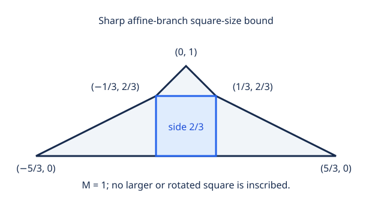

# Sharp square size for two Lipschitz graphs with one affine branch

Let f and g be 1-Lipschitz functions on a compact interval, equal at the
endpoints, with f<g inside. If one branch is affine and M=max(g−f), then their
closed curve inscribes a square of Euclidean side **at least 2M/3**.
One side of the guaranteed square lies on the affine branch.

The factor **2/3 is exact even allowing every orientation**. The rational
pentagon below has M=1 and exactly one inscribed square, of side 2/3.
No convexity assumption is made on the other branch or the enclosed domain.



The [complete proof](PROOF.md) rotates the affine branch to a horizontal
base, retains reciprocal one-sided slope bounds, and constructs a square
straddling a height maximum by the intermediate value theorem. The refined
bound for affine slope m is `2 sqrt(1+m²) M/(3+m²)`; only the uniform constant
2/3 is asserted to be sharp. An elementary saturation argument excludes every
other orientation in the extremizer.

This is a sharp quantitative result for a restricted family. Square existence
for these curves was already known. [Primary sources and scope](REFERENCES.md)
explain Rifford's general quantitative theorem and proposed constant 1/2:
the present result rules out an affine branch as an extremizer for that
proposed value. It does not resolve the unrestricted quantitative problem or
the general square-peg problem. No historical-priority claim is made.

## Reproduce the exact checks

Python 3.11+, standard library only. From this directory:

```sh
python3 verify.py
```

Expected first line: `PASS: exact edge-assignment checks match expected.json`.
The remaining JSON must match [expected.json](expected.json). The verifier
uses [fixtures.json](fixtures.json) and exact rational arithmetic. It covers
all assignments of four square vertices to polygon boundary edges, including
rank-deficient systems. It enumerates every vertex of the resulting bounded
linear-constraint polytopes; convexity of squared side length then certifies
the largest possible square over all real parameters and all orientations.
The completeness argument is in PROOF.md, Section 4.

| Fixture | Assignments | Largest squared side |
| --- | ---: | ---: |
| Sharp pentagon | 625 | 4/9 |
| Right-isosceles triangle | 81 | 1/2 |
| Flatter triangle | 81 | 16/25 |
| Rectangle with a continuum of squares | 256 | 4 |
| Tilted-base triangle | 81 | 1/2 |
| Exact rigid motion of the sharp pentagon | 625 | 4/9 |

There are **1,749 assignments** in total. The sharp pentagon has 91 feasible
assignments, seven of them singular. Every singular one contains only
zero-size squares, and every nondegenerate assignment gives the same square.
The rectangle control has nonzero squares in singular polytopes; those
polytopes are handled explicitly. The right triangle tests the larger rotated
square that would be missed by restricting the search to horizontal squares.
The tilted triangle also checks a baseline-parallel square attaining the
proof's refined bound `s²=425/882` for `m=3/5`, `M=1`.

`python3 verify.py --emit` regenerates the summary without comparing it with
the saved expected file. No file is overwritten by that command. The manifest
hashes the source and compact evidence, excluding itself. No dataset, solver,
downloaded paper, private graph data, or environment is included.

The written all-function lower bound and uniqueness proof remain unformalized.
The exact enumeration is corroboration via a different method; it is not an
independent peer review. The named sharp-bound target is complete.
