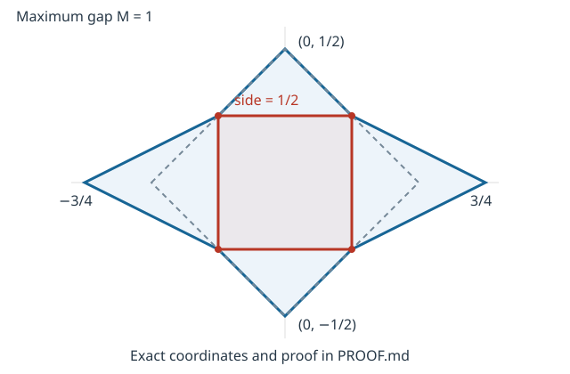

# A square of side at least half the maximum gap

Two 1-Lipschitz graphs with common endpoint values and strict separation
inside their interval always inscribe a square of side **at least M/2**,
where M is their maximum vertical gap. The constant **1/2 is optimal**.

The proof combines Greene–Lobb's existing spectral monotonicity theorem
with Rifford's existing local integral inequality, identified with the
square action. An contained diamond forces action at
least M²/4; the Lipschitz bounds make that action at most the square's
side squared. [PROOF.md](PROOF.md) checks the action convention, preferred
capping, strictly nested comparison, and passage to general Lipschitz
branches. [SOURCES.md](SOURCES.md) identifies every imported theorem.

This settles the quantitative constant proposed by Rifford in the cited
source, within the searched literature. It does not settle the square-peg
problem for arbitrary Jordan curves. Historical priority and independent
review remain open. Rifford's integral inequality and Greene–Lobb's Floer machinery and
diamond comparison construction are prior art and external proof
dependencies.



The rational curve pictured has M=1 and only one inscribed nonzero square,
of side 1/2. Its complete 4096-assignment exact certificate also handles
singular supporting-line systems.

## Reproduce the finite evidence

Python 3.11+, standard library only, from this directory:

```sh
python3 verify.py --check
python3 -O verify.py --check
sha256sum -c SHA256SUMS
```

Both Python runs must print the exact JSON in [EXPECTED.json](EXPECTED.json),
with `status: pass`, `max_gap: 1`, and `max_side_squared: 1/4`.
`--emit` regenerates the summary without comparing it. The code verifies
sharpness, action normalization, and local inequalities; **it does not
verify the universal Floer argument**. There is no solver, floating-point
inference, external dataset, or unpublished large certificate.

The rational polytope kernel is reused with attribution from the earlier
square-localization package; validation is author checking, not independent
peer review. The earlier localization counterexample remains valid.
