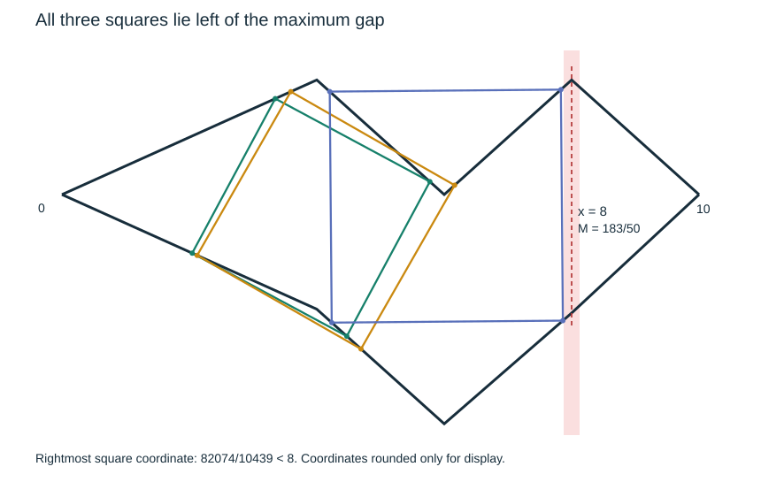

# Squares need not occur at the maximum gap

Two rational piecewise affine graphs, each with Lipschitz constant at most
0.93, form a Jordan curve with a unique maximum vertical gap at x=8.
The curve has exactly three inscribed squares; all lie strictly to the
left of x=8. Their rightmost coordinate is 82074/10439, leaving a gap
1438/10439 to the maximum-gap point.

The failure persists under small uniform perturbations within the class
of two strict-Lipschitz graphs. In particular, counterexamples exist with
two rational-coefficient polynomial branches. This disproves a natural
localization route to the proposed half-gap square-size bound. **It does
not refute that size bound or square existence.** The localization property
is a route proposed in this work, not an assertion attributed to Rifford.



Read [PROOF.md](PROOF.md) for the geometric reduction, the finite certificate,
the reusable stability lemma, and polynomial approximation. See
[REFERENCES.md](REFERENCES.md) for the primary literature and attribution.

Reproduce with CPython 3.11 or later, standard library only:

```sh
python3 verify.py
python3 -O verify.py
sha256sum -c SHA256SUMS
```

Run from this directory. Both Python commands compare against `expected.json`
and print JSON with `status: pass`. `--emit` regenerates the summary without
comparing it. Runtime is a few seconds. No external dataset, solver, network
access, or floating-point calculation is required by the verifier.

The exact checker examines all 100 geometrically reduced assignments and,
separately, all 4096 unrestricted assignments of square vertices to polygon
edges. They give the same three squares and no nonzero singular family.
A rational rigid motion and a rectangle with a continuum of squares check
coordinate invariance and singular-system handling. Both formulations share
an elimination kernel adapted from this repository's earlier affine-branch
verifier; this is author validation, not independent review.

The finite witness is computer-assisted. The stability and polynomial
consequences are proved analytically, with no explicit perturbation radius
or polynomial degree bound claimed. The diagram uses rounded display
coordinates; only the rational source and proof establish the result.
