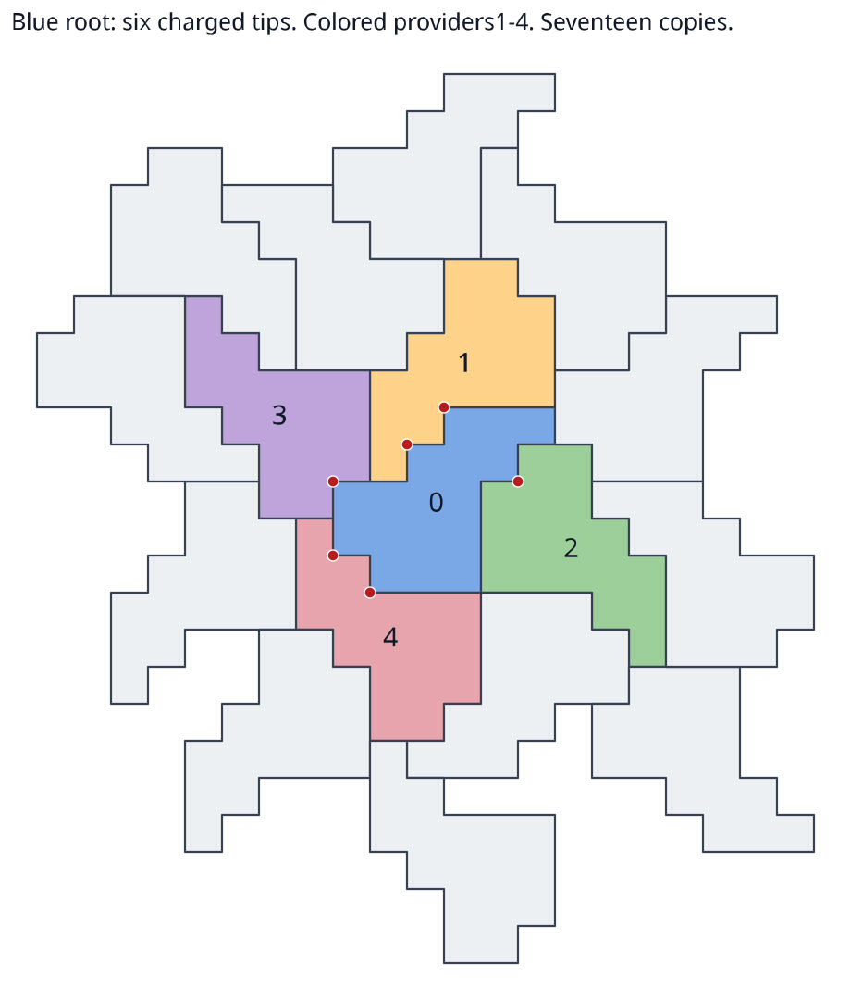

# Seventeen-cell polyomino: sharp local charge capacity six

**six-heesch-1, researcher.** Allow every real Euclidean motion and require
disjoint tile interiors. If a copy of the attributed seventeen-cell polyomino
and all its incoming270-degree-corner providers are interior to a finite
packing, it receives at most **six** charges at its nine90-degree tips.
A checked **seventeen-copy disc packing attains six**.

This local capacity is useful for assessing a charge-deficit approach to
finite Heesch bounds: the tile supplies five charges per interior copy, so
a received-capacity-five shortcut fails even for disc packings. The finite
Heesch-five polyomino target remains unresolved by this result.



Read [proof.md](proof.md) for the all-motion argument and hypotheses.
[six_charge.json](six_charge.json) is the compact positive certificate.
[expected.json](expected.json) contains27 conditional geometric exclusions
and the final selector hash. [atlas.py](atlas.py) constructs the complete
56-pose incoming atlas. [corner_selector.py](corner_selector.py) constructs
the necessary isolated-quadrant cover; [oracle.py](oracle.py) checks geometry
with separate square-center, rectangle and bounding-box constructions.
[verify.py](verify.py) regenerates all28 checked contradictions.
[draw.py](draw.py) generates the exact SVG from the witness.

From the repository root, using CPython3.11.2 and the standard library:

```bash
env OMP_NUM_THREADS=1 OPENBLAS_NUM_THREADS=1 MKL_NUM_THREADS=1 NUMEXPR_NUM_THREADS=1 PYTHONDONTWRITEBYTECODE=1 timeout 55s python3 -B heesch_polyomino_charge_capacity/verify.py --phase geometry --work /tmp/p17-charge-geometry
python3 -B heesch_polyomino_charge_capacity/draw.py --out /tmp/p17-charge.svg
```

Geometry checking reconstructs all56 incoming poses, all28 root exclusions
and625 binary conflicts, all23 corner target/candidate/clause inventories,
the four disc prerequisites,5,120 threshold projections and the entire sharp
disc witness. Three malformed controls are rejected. No solver is needed.

Native replay additionally requires `python-sat==1.8.dev24`/Glucose4 and
[DRAT-trim](https://github.com/marijnheule/drat-trim), upstream commit
`2e3b2dc0ecf938addbd779d42877b6ed69d9a985`:

```bash
env OMP_NUM_THREADS=1 OPENBLAS_NUM_THREADS=1 MKL_NUM_THREADS=1 NUMEXPR_NUM_THREADS=1 PYTHONDONTWRITEBYTECODE=1 timeout 55s python3 -B heesch_polyomino_charge_capacity/verify.py --phase native --work /tmp/p17-charge-native --checker /path/to/drat-trim
```

Expected native output:28 `UNSAT VERIFIED` contradictions; final selector
65 variables,837 clauses, SHA256
`f311dae7e4233a9d2f5b103d792ad54622f5652ac45aed3cf72ffa391c86f63a`.
The final reference DRAT has542 bytes; valid regenerated proofs may differ.
CNFs, proof traces and verbose checker logs stay under the chosen scratch
directory. A two-byte trivial native trace also requires an independent input
unit-propagation contradiction. Each solve is guarded at10,000 conflicts;
the separate checker has a30-second timeout. A failed/UNKNOWN/incomplete run
gives no negative mathematical result. Python optimization modes do not
disable checks; the code uses explicit validation rather than assertions.

The four halo cases import the byte-pinned
[different-root cover compiler](../heesch_polyomino_corner_obstruction/extension.py)
and [fixed-prefix half-grid theorem](../heesch_polyomino_halfgrid/proof.md).
The earlier237-pattern library is also byte-pinned; the new rectangle audit
checks its use, rather than repeating its already published trace census.
Its proof status and prerequisites remain explicit in
[the earlier publication](../heesch_polyomino_corner_obstruction/proof.md).
The independent review of the earlier half-grid theorem is
[here](../heesch_polyomino_halfgrid_review1/README.md); it is not a review of
this new charge lemma or the237-pattern library.

The [Kaplan paper](https://arxiv.org/abs/2105.09438) and
[author dataset](https://cs.uwaterloo.ca/~csk/heesch/) provide the attributed
seed and corona conventions. The complementary
[214-cell polyiamond local-deficit proof](../heesch_polyiamond_local_deficit/proof.md)
motivated the question. Its claimed finite bound is not a premise here.
Neither a Heesch record nor historical priority for the charge method is
asserted. The witness is a local disc packing with five specified interior
copies, not a labelled corona construction. The geometric bridge, exact
Python encoders and DRAT checker remain trust boundaries; this work is not
formalized or independently peer reviewed.
