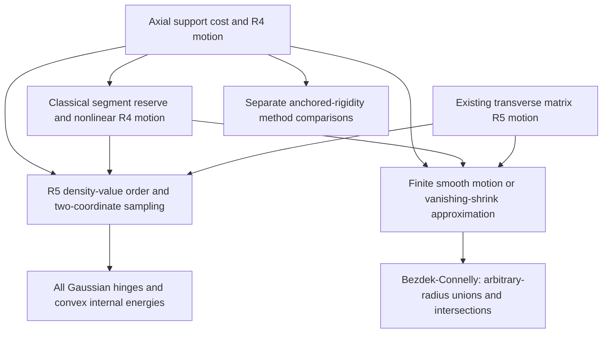

# Axial cones and nonlinear robustness: review portfolio

Author consolidation, 26 September 2026. This is a review checkpoint for
existing results, with no added sufficient class. The headline is a
geometric class of three-dimensional contractions with full Gaussian
majorisation and arbitrary-radius Kneser--Poulsen consequences, together
with a quantitative nonlinear closure of that class. The proofs and exact
checkers are available; independent correctness review and historical
priority assessment remain pending. The unrestricted R3 problem is open.

The later [all-eight lane handoff](LANE_HANDOFF.md) records the incoming
lane interfaces, particularly the distinction between researcher 4's
extremal-map/mesh reduction and this constructive-motion portfolio.
It changes no positive hypothesis and supplies structural descriptions
of the existing benchmarks for that interface.

The subsequent [regularity audit](REGULARITY.md), module G, closes the extra
time-regularity qualification in M's ball transfer on the same geometric
class. Its proof uses vanishing target scaling and includes the equality
case and colliding labels. This is an additional author proof, not an
independent review of the frozen modules; their original files are unchanged.

The mathematical baseline is source commit
`01b707bf3eb19f7bd44b8c45771fffa7b7651b55`.
[PORTFOLIO.json](PORTFOLIO.json) records the proof modules, source commits,
committed graph references, logical dependencies, comparison sources,
file hashes and exact checker outputs. The four mathematical proof files,
all five checkers and all five expected-output files retain their baseline
bytes. This checkpoint updates the reading and comparison material only.

## 1. Claims to review, in order

Write `gamma_(3,s)` for the isotropic Gaussian of covariance `s I_3` and

    H(f,h) = integral_R3 (f(x)-h)_+ dx.

For a map T on a domain D, the full Gaussian conclusion below means

    H(mu*gamma_(3,s),h) <= H((T#mu)*gamma_(3,s),h)

for **every** bounded Borel probability law mu on D, every s>0 and h>=0.
It includes arbitrary atom counts, all probability weights, mass at the
origin and nonatomic laws. It gives convex internal-energy comparisons
whenever defined. The ball conclusion means, for **every** finite labeled
set x_i in D and **every** collection of retained radii R_i>=0,

    volume union_i B(Tx_i,R_i) <= volume union_i B(x_i,R_i),
    volume intersection_i B(Tx_i,R_i) >= volume intersection_i B(x_i,R_i).

The statements are non-strict. These quantifiers are part of the claims;
checking a finite set of weights, variances, energies or radii cannot
replace them. General affine changes of the Gaussian metric are excluded.

| Module | Exact positive claim | Scope boundary |
| --- | --- | --- |
| **A: original axial theorem**, [PROOF.md](PROOF.md), Sections 1--3 | Let P,Q be centrally symmetric compact convex planar bodies with zero in their interiors. Set C(P)={(zu,z):z>=0,u in P}, and W=conv{conjugate(u)v:u in P,v in Q}. If per W<=4, T fixes C(P) and maps -b to b for b in C(Q). It has an R4 contracting motion, full Gaussian comparison and both ball conclusions. | Same original, undamped endpoints. Whole domains, arbitrary heights and distributions; probability support is bounded. Necessity of per W<=4 is proved only within the specified absolutely continuous axial rotation form. |
| **R: uniform nonlinear closure**, [ROBUSTNESS.md](ROBUSTNESS.md), Sections 1--2 | If a base map T has an R^m motion, S=Id+e on D with Lip(e)<=epsilon<1, and V=lambda Id+g on T(D) with Lip(g)<=eta, assume lambda>0, eta<=lambda and epsilon+eta+lambda<=1. Then V T S^(-1) has a motion in the same dimension. Applied to A, it has all the conclusions above on S(D). | The target scaling is essential to this sufficient reserve. At lambda=1 it permits only constant errors. The target error is a function on T(D), so it respects collisions of T. Spatial smoothness is unnecessary; ball transfer needs the base finite motions' time regularity. |
| **R2: a full endpoint neighborhood**, ROBUSTNESS, Sections 3--5 | For the original 25-point pair (X,Y), all independent endpoint errors of norm at most 1/2000 around (X,(19/20)Y) retain every Gaussian and ball conclusion. Every such matching has minimum ambient motion dimension exactly four, paired affine rank six and no scalar-defect certificate. | The strict interior is open in all 150 labeled endpoint coordinates. No plane, cone, fixed-anchor or rigid-cluster equality remains. This is centered at a damped pair, not at (X,Y). The finite strong-composition exclusion is **not** extended to this neighborhood. |
| **C: method separation**, [COMPOSITIONS.md](COMPOSITIONS.md) | For an anchored flip (0,A,-B)->(0,A,B), with A and B spanning R3, a finite sequence of strong contractions in R3, allowing new rigid frames at every step, requires I_3 to be a finite sum of u v^T with u in A*, v in B*. A dual matrix disproves this for the original fixture and circular cones with pq>1/2. | A necessary condition, not a factorization characterization. Exact within-cluster endpoint rigidity and prescribed labels are premises. No exclusion of higher-dimensional steps, infinite limiting factorizations or compositions of other methods. |
| **M: existing secondary extension**, [MATRIX_PATHS.md](MATRIX_PATHS.md), with [G's regularity completion](REGULARITY.md) | For compact planar sections P,Q containing zero, an absolutely continuous operator-norm-one path A(t) from -I to I with integral max[-u^T A'(t)v]<=2 supplies an R5 motion and full Gaussian comparison. G gives both ball conclusions under these same hypotheses, also after R's existing nonlinear reserve. The explicit circular path gives pq<=1/(1+cos(1)). | General sections need not be convex or symmetric. G uses finite smooth approximants with target scaling tending to one; it does not assert an exact smooth motion at the undamped endpoint. The circular cost is optimal only among the specified block-diagonal relative Gram motions. No R4 impossibility or arbitrary-R5 optimality is asserted. |

Module M was published before this checkpoint and is retained for review.
It is not needed for A, C or the explicit R2 neighborhood. Review of the
core portfolio can finish without accepting its optimization theorem.

## 2. Dependency chain and decisive correctness checks

The proof separates geometric input from established transfer results:

The edge M -> B uses G's approximation and volume-limit argument.
The comparison branch C does not establish the positive inequalities and
is not a premise of them. R2's negative R3 result uses an additional
orientation argument with uniform Gram bounds, not C's exact rigidity.

| Review obligation | Precise point to verify | Consequence of a gap |
| --- | --- | --- |
| A's support cost and sign | Cauchy's planar formula gives integral_0^pi k(theta) dtheta=per W/2 for k=max u dot J R_theta v. The chosen increasing axial coefficient pays for every cross-pair derivative, while each cluster stays rigid. See PROOF Sections 1--2. | The universal geometric premise would fail; a finite fixture audit alone could not repair it. |
| The full Gaussian bridge | [Aishwarya--Li, Theorem 1.4(i)(a)](https://arxiv.org/html/2609.07041v2) gives stochastic order of density values sampled from their own densities. For X of density f and independent Y~gamma_(2,s), with C_s=(2 pi s)^(-1), P[f(X)gamma_(2,s)(Y)>C_s h]=H(f,h). PROOF equation (17) uses this identity after padding to R5. | Order of generic products, or finitely many Renyi comparisons, would not justify the claimed hinges. The geometric motion remains a separate claim. |
| Every individual radius | For finite centers in A, choose smaller symmetric polygonal sections containing the finitely many normalized points. Their product perimeter cannot increase. The support envelope has finitely many analytic pieces; reparametrize square-root endpoints. Apply [Bezdek--Connelly, Theorem 1](https://arxiv.org/pdf/math/0108098) to the reversed R5 motion. | A merely continuous path, without the stated regularity argument, does not by itself justify this invocation of the ball theorem. |
| Uniform nonlinear reserve | Choose lambda+eta<=r<=1-epsilon and concatenate Sx -> rx -> rTx -> VTx. The endpoint test for a segment u -> v is v dot(v-u)<=0. For the last segment its worst value is max of (lambda+/-eta)(lambda+/-eta-r). ROBUSTNESS Section 1. | Separate bounds on endpoint distances would not suffice to prove monotonicity throughout each segment. |
| R2's whole neighborhood | Separation bounds give epsilon=1/200, eta=1/50, r=49/50, hence map Lipschitz constant <=194/199. For any hypothetical R3 motion, both selected anchored Gram matrices stay >=(2223/10000)I, while their relative orientation must change. ROBUSTNESS Sections 3--4. | Checking sampled perturbed endpoints would not prove either the uniform neighborhood or absence of every intermediate R3 motion. |
| C's arbitrary chain length | Normalize the first anchored rigid cloud at each stage. Equality of all within-cloud distances forces each changed frame coordinate to have a common sign on a spanning cloud. Each step's relative orthogonal increment is 2 sum u v^T with the required positive-dual signs. Telescope from -I to I. | A single-step obstruction or a search over bounded chain lengths would not give the finite-composition claim. |
| M's lift and optimality boundary | A continuous rank-one residual square root must join through all rank drops. For the lower bound, use L=diag(A,c), rank(I-L^T L)<=2, and reparametrize by monotone c. The norm-boundary path length is at least 2(1+cos(1)). MATRIX_PATHS Sections 1--3. | Failure here affects M's extension or restricted optimality; it would not invalidate the independent original R4 proof. |
| G's regularity completion | Radially normalized polygonal matrix curves converge strongly in W1,1 even at nonsmooth norm strata. Finite support costs converge; a positive minimum target separation permits vanishing scaling to absorb their distance-speed errors. Remove colliding targets with the correct radius extremum, separately for unions and intersections. REGULARITY Sections 2--6. | A uniform approximation alone does not control derivatives; an unproved assertion of smooth exact-endpoint motions would not suffice. Failure would restore M's earlier extra regularity qualification, without changing A/R's explicit finite motions. |

The analytic bridge is also written in Team B's
[rank-five source](../gaussian_majorisation_rank_abel/PROOF.md); the needed
identity is reproduced in PROOF, so no unstated team lemma substitutes for
it. Kirszbraun extension is optional when passing from a domain map to a
global 1-Lipschitz formulation. No extension is needed for the stated
finite motion or its ball consequences.

## 3. Breadth and the Kneser--Poulsen claim

For circular sections of slopes p,q, the original perimeter condition is
pq<=2/pi. The subinterval

    1/2 < pq <= 2/pi

is the core added coverage: arbitrary bounded distributions on whole cone
domains, and arbitrary finite centers with arbitrary individual ball radii.
The theorem also uses noncircular section shape, rather than only enclosing
cone angles. Controlled nonlinear domain and target changes preserve this
coverage after the reserve in R. R2 gives a concrete full neighborhood of
finite labeled ball contractions requiring four-dimensional motion.

The claimed new Kneser--Poulsen consequence is this explicit geometric
coverage of the already established volume-transfer theorem. A new
general volume-transfer theorem is not claimed. The named method
separations below are proved within the packet; they are not a proof of
priority over every result in the literature. Historical novelty remains
a review question.

| Comparison | What is established | What is not established |
| --- | --- | --- |
| [Team B simplicial reflections](../gaussian_simplicial_cone_reflections/PROOF.md) | A separator C_q subset K subset C_p* exists for the full circular cones exactly when pq<=1/2. The original 25-point fixture also has no simplicial separator. Conversely, the standard self-dual orthant forces per W>=8 under every common axis and symmetric enclosing sections. Thus the **original perimeter criterion** and the simplicial criterion are not nested. | The orthant argument is not an obstruction to all motions, or a classification against the later general matrix-path criterion. The simplicial packet is a team author result, not an independently reviewed theorem merely because it is cited here. |
| Established strong contractions | [Bezdek--Naszodi, Section 1.2 and Theorem 1.3](https://arxiv.org/pdf/1701.05074) give ball comparisons for coordinatewise contractions. C excludes every finite composition in R3, with changing frames, on circular cones with pq>1/2 and on the undamped 25-point fixture. One-sided hyperplane folds are included. | This exclusion is not transferred to R2's damped perturbed configurations, or to compositions involving other sufficient classes. |
| [Paired rank <=5](../gaussian_majorisation_rank_abel/PROOF.md) and [scalar defect](../gaussian_majorisation_scalar_defect/PROOF.md) | The original fixture and the whole R2 neighborhood have rank six and fail the scalar unit-vector test. The underlying scalar obstruction for rigid anchored flips is credited to the scalar-defect source. | Failure of either certificate is not failure of majorisation or of a nonlinear R5 motion. |
| [Common-target mixtures](../gaussian_majorisation_common_target/PROOF.md) | Injectivity forces each deterministic common-output component to use the original source law; distinct positive weights additionally force the prescribed matching. Combined with an applicable certificate obstruction, this restricts those decompositions. | Equal weights can permit rematching. Arbitrary stochastic couplings and post-convolution decompositions are not excluded. Its [independent review](../gaussian_majorisation_common_target_review2/README.md) reviews that packet alone. |
| [Damped cone motions](../gaussian_damped_cone_reflections/PROOF.md) | The earlier support-cost route includes the original axial construction at damping one; its larger positive range changes the endpoints by damping. Its exact-dual nonsimplicial obstruction at pq=1 is an obstruction to R5 motion. | Neither that obstruction nor the other failed certificates are negative Gaussian hinges. The damped result does not prove the remaining undamped full-cone range. |
| [Ordered square-cone orbit comparison](../gaussian_majorisation_square_cone_orbits/ORDERED_WEIGHTS.md) | The newer theorem gives all-variance hinges with ordered directional weights and an unequal-radius **union** consequence, including invariant measures. It applies to a prescribed matching with no R5 motion. This is a complementary geometric advance that the old fixed-weight comparison did not supply. | Its weights/radii are ordered, and this source does not supply the arbitrary-radius intersection conclusion of A/R. No general containment between the classes is asserted. |
| [Bounded-law stability](../gaussian_majorisation_open_stability/BOUNDED_LAWS.md), [paired layers](../gaussian_paired_layers_majorisation/ALL_VARIANCES.md) | These analytic results give law-dependent stability on compact variance intervals, or an all-variance constrained neighborhood with weight restrictions. They are useful context, not premises of R. | They do not by themselves provide R's uniform whole-domain, all-weight, all-variance and arbitrary-radius statement. R also does not cover arbitrary nonatomic perturbations without its Lipschitz-error condition. |
| [Fixed-atom reduction](../gaussian_majorisation_global_criterion/ANCHOR_REDUCTION.md) | This reduces the full question to a prescribed dominant fixed atom plus an arbitrary bounded rare law. It identifies a possible global route; the rare law need not lie in these cones. | The reduction alone neither extends this positive class nor supplies a counterexample. |

The companion [global handoff](../gaussian_majorisation_global_criterion/DEPENDENCIES.md)
and [functional/stability handoff](../gaussian_majorisation_open_stability/HANDOFF.md)
retain these quantifier distinctions. They are consolidations, not
independent reviews of this packet. Two additional source publications
were inspected during the final refresh:

- The [common-set transfer theorem](../gaussian_prior_localization/PROOF.md)
  expresses all-law majorisation on a compact domain as a simultaneous
  Gaussian set-mass comparison. Its unique diffuse optimizer rules out
  exact finite-support minimizer localization, while allowing finite
  witnesses of strict failure. It neither changes the axial domain nor
  verifies its proof independently.
- The [finite orthogonal averaging obstruction](../gaussian_majorisation_finite_orbit_obstruction/PROOF.md)
  rules out one fixed finite positive orthogonal rule proving every
  pointwise hinge for all square-cone weights, even at one variance and
  one prescribed origin mass. It does not refute integrated majorisation,
  weight-adaptive or infinite averaging, or the motion theorem here.

For the circular map endpoint contraction holds up to pq=1. The existing
M extension covers pq<=1/(1+cos(1)); the full all-law comparison for larger
pq up to 1 is not decided by this portfolio. Its block-relative-Gram
optimality statement does not close that gap by other motions or methods.

## 4. Keep the three finite witnesses distinct

All use the twelve rational directions D12 specified in PROOF, but they
support different claims. No constants or obstructions are interchangeable.

| Witness | Exact positive certificate | Method separation actually proved |
| --- | --- | --- |
| Original X=(0,A,-B), Y=(0,A,B), p=3/4, q=4/5 | R4 motion; 144 strictly contracting cross pairs and 156 preserved pairs. Paired minor 288/25. | Minimum dimension 4; no simplicial separator; no scalar defect; no finite aligned strong chain, with H=diag(-8,-8,15), tr H=-1 and dual-generator minimum 5/27. |
| Every pair within endpoint radius 1/2000 of (X,(19/20)Y) | Same-dimensional concatenation; map Lipschitz constant <=194/199; intermediate Gram margin 2223/10000. | Minimum dimension 4 even after independent endpoint alignments; paired-rank singular margin >377/500; scalar contradiction gap 151439/93750. No finite-strong-chain exclusion is claimed here. |
| Existing M witness, p=4/5, q=81/100 | R5 matrix path with rational auxiliary radius 4/5, cost reserve at least 2/4375. Its displayed finite product perimeter exceeds 4 by at least 3379/62500. | Paired minor 209952/15625; strong-chain dual minimum 935/729. Its displayed axial perimeter fails; no all-axis perimeter exclusion or minimum dimension 5 is asserted. |

These comparisons concern prescribed labels. Distinct radii force a
radius-preserving permutation to fix the labels, but do not establish
uniqueness of an arbitrary alternative representation of the same ball
union. No such representation theorem is claimed for these witnesses.

## 5. Attribution and unresolved priority questions

The sole problem source remains
[Aishwarya--Li arXiv:2609.07041v2](https://arxiv.org/abs/2609.07041),
revised 13 September 2026 and rechecked on 26 September 2026. Its Gaussian
comparison theorem and two-auxiliary-coordinate principle are prior work.
Bezdek--Connelly's motion-to-volume theorem, Cauchy's perimeter identity,
Euclidean Lipschitz extension and the classical
[firmly nonexpansive segment condition](https://cmps-people.ok.ubc.ca/bauschke/Research/c10.pdf)
are credited inputs. R's value is the quantified closure and geometry of
the resulting neighborhoods, not discovery of the segment criterion.

The author has rechecked the cited primary statements and performed a
bounded live search for cone reflections, two rigid clusters, rotations,
low-dimensional motions and strong contractions. No identical source was
located in that search. This establishes no historical priority. In
particular, the following questions remain open for external review:

1. Is A's explicit support-perimeter motion, or a theorem already implying
   its full cone-domain coverage, present in earlier geometric literature?
2. Is C's finite-chain positive-dual obstruction an existing factorization
   theorem in another formulation? The single-step ball theorem is prior
   work; the claimed additional comparison is the arbitrary finite chain.
3. Is R2's all-coordinate neighborhood, with its uniform R3 obstruction,
   already covered by a published motion-stability theorem? Classical
   concatenation and matrix perturbation estimates alone are not new.
4. Is M's operator-norm boundary length calculation or its geometric
   interpretation known? Its restricted optimality must not be described
   as optimality among every five-dimensional motion.

[SOURCES.md](SOURCES.md) retains detailed provenance and historical team
context. The current comparison table above supersedes older fixed-weight
orbit descriptions when assessing the portfolio's present coverage.

## 6. Reproduction and review disposition

Use the standard-library commands in [README.md](README.md), including the
`-O` variants, then run `sha256sum -c SHA256SUMS`. The five audit markers and
canonical output digests are recorded there and in PORTFOLIO. The author
replayed all five checkers on CPython 3.11.2 and 3.12.14 in both modes for
this consolidation. All 20 runs matched their existing expected outputs;
no checker or expected certificate changed.

These are exact rational and polynomial audits of identities, fixture
geometry and uniform constants. The 128 corner Gram checks use an
alternative enclosure of the neighborhood bound, but remain author work.
No finite computation establishes the universal analytic bridges, the
completeness of the motion argument, or historical novelty by itself.
There is no proof-assistant formalization or independent replay of this
portfolio being claimed.

The committed axial, composition, robustness and matrix contributions
are author proof attempts; the scope contribution is a summary. The
initial graph refresh for this checkpoint, at indexed height 6119, found
no incoming independent review, verification or objection on those
modules. The independently reviewed common-target comparison dependency
does not confer review status on this portfolio. Commitment and public
source availability likewise do not constitute mathematical acceptance.

The next checkpoint should resolve concrete correctness or priority
feedback against these frozen modules. New sufficient subclasses are
deferred until that review catches up. A failed auxiliary comparison can
be repaired or withdrawn without silently weakening the headline's
quantifiers; a failed positive premise must be reflected explicitly in
the dependent Gaussian and ball claims.
