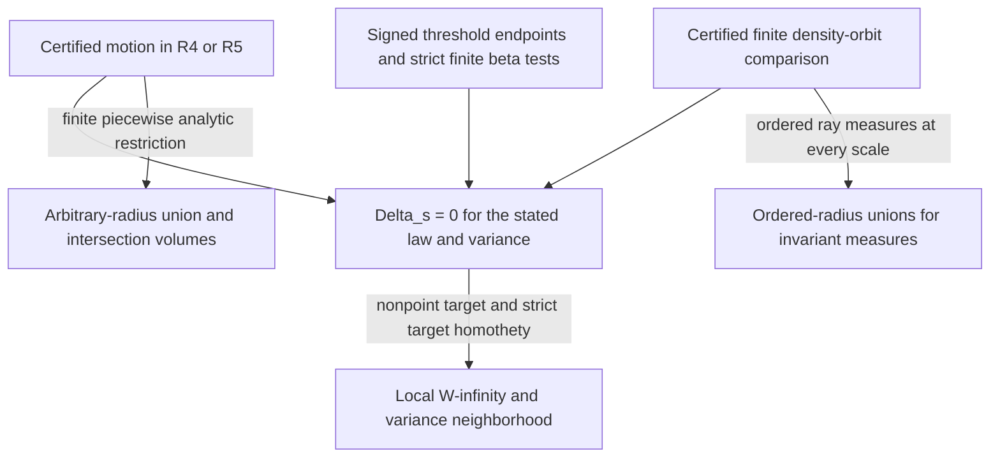

# Team B: implications, geometric classes and remaining obligations

Current handoff, 26 September 2026. The full bounded-law R3 question is
**open**. This is a synthesis of existing proofs, not a new comparison
theorem or an independent review. The new ordered-weight source below
is an exact computer-assisted author proof awaiting review.
[SOURCES.md](SOURCES.md) records source revisions and the current graph
handoff. Every arrow retains the hypotheses stated here.

The human-authorized expansion to eight lanes is recorded in the compact
[fixed-atom/global-criterion interface](INTERFACES.md). It connects the
new common-set dual and finite-rule obstruction to this criterion, with
an explicit strict-witness error budget and the original lane ownership.

## 1. The full question and its equivalent endpoints

For one bounded contraction pair `f=mu*gamma_s`, `g=(T#mu)*gamma_s`, set
`H_f(a)=integral(f-a)_+` and `Delta_s=sup_a(H_f(a)-H_g(a))_+`.

| Statement | Logical status | Scope that must be retained |
|---|---|---|
| Every hinge compares; `Delta_s=0` | The fixed-pair full majorisation assertion | One specified law, contraction and variance. The full conjecture quantifies over **all three**. |
| Zero failure in the specified five-dimensional endpoint density-value coupling | Equivalent to `Delta_s=0`; the minimum failure probability is exactly `Delta_s` | A coupling of smoothed density values, not a position martingale or a motion of labelled centres. See [global proof, Theorem 1](PROOF.md). |
| Every beta test is nonnegative, or the complete endpoint Hankel hierarchy is positive semidefinite | Equivalent to `Delta_s=0` | All orders at the **same** variance. [Global proof](PROOF.md) and [Hankel source](../gaussian_majorisation_hankel_transport/PROOF.md). |
| At variance one, every `(1-epsilon)delta_0+epsilon rho` compares under every contraction fixing zero | Equivalent to the **full conjecture**, for any one fixed `0<epsilon<1` | `rho` is an arbitrary bounded law, with no support radius uniform over the class. This restricted assertion remains unproved. [Fixed-atom reduction](ANCHOR_REDUCTION.md). |
| Every finite-volume source set has a common target set with the anchored compensation inequality | Equivalent to the all-prior fixed-atom assertion on each compact domain | The target set works simultaneously for every rare prior; retain `(1-epsilon)q(0)+epsilon min_K q`. [Common-set source](../gaussian_prior_localization/PROOF.md) and [quantifier interface](INTERFACES.md). |
| Any violation yields a finite strict rational contraction witness | An exact witness reduction | This qualitative reduction does not bound the atom count or produce a witness. [Finite/rational reduction](../gaussian_majorisation_rank_abel/PROOF.md). |
| `D_k=0` for every compact finite frontier, or `L_k=0` for every finite moment maximum in the interface | Equivalent to the full question; `0<=D-D_k<4/k` and `0<=D-L_k<5/k` | The [uniform localization](../gaussian_prior_localization/DEFECT_LOCALIZATION.md) controls support and atom number by the permitted loss. [The interface, Section 4](INTERFACES.md) adds the global moment error. Each maximum is over all real feasible configurations, not sampled points. No maximum's sign is evaluated. |
| Every strict rational finite contraction has a finite signed certificate | Equivalent to the full question, with `for every instance, there exists a certificate` | The [functional interface](../gaussian_majorisation_open_stability/CERTIFICATE_INTERFACE.md) retains a signed low endpoint, absolute source peak and strict beta margins. The uniform approximation above does not give a uniform degree for an exact zero certificate. |
| `J_f>=J_g` at every globally ordered contact for the regularized strict-contraction test class | Equivalent to the full question by the [PDE contact reduction](../gaussian_majorisation_heat_profiles/CONTACT_REDUCTION.md) | The author reduction reaches a transverse contact and includes critical levels using bulk flux. The contact sign remains open; its auxiliary input has Gaussian tails and no uniform time or volume cutoff is claimed. |
| Every weighted rigid tetrahedral mesh restriction compares | Equivalent to the full question by support enlargement | The [map-lane source](../gaussian_majorisation_extremal_maps/PROOF.md) imposes no mesh-size bound and does not claim a fixed-domain extreme optimizer. The [interface](INTERFACES.md) explains preservation of a prescribed dominant atom by adding mass only to the rare packet. |

The global finite differences give `D_N` increasing to `Delta_s`, with
`D_N <= Delta_s <= min(1,D_N+K(N+2)^(-1/4))` for the explicit support
constant in [PROOF.md](PROOF.md). A negative beta test proves a negative
convex-energy comparison when its contraction data and sign are certified.
Bare nonnegative tests at finitely many orders give an error bound. A
finite positive **certificate** additionally needs the endpoint and
strict-margin information in Section 4 below.

The fixed-atom reduction does not turn an arbitrary-origin-mass theorem
on a restricted set of rays into a solution: its remaining packet and
contraction must be arbitrary. Its conditional near-Gaussian violations
also do not assert that a counterexample exists. A base zero defect gives
only a small error after a distant common Gaussian is adjoined, so there
is no proved general positive adjunction rule at finite separation.

There is now a quantitative composition for **strict failures**: first
localize by the measure-lane theorem, then add a new anchor. At a prescribed
rare mass epsilon, a hypothetical gap delta yields a variance-one anchored
gap at least epsilon delta/2 with at most k^6+1 sites and radius
16k+sqrt(8 log(1/epsilon)), for k>=10/delta. The [interface](INTERFACES.md)
checks contraction and error constants. This changes the rare prior; it
does not preserve a dominant atom while conditioning. The radius depends
on the defect resolution, and later rigid-mesh enlargement has no proved
vertex bound. This supplies no positive family or Kneser--Poulsen consequence.

## 2. Sufficient mechanisms and their geometric endpoints

The diagram displays sufficient constructions, not a chain of equivalent
geometric classes. The motion-to-volume arrow uses finite piecewise
analytic restrictions; the ordered-orbit arrow uses its own small-variance
exponential weights. No arrow from a single fixed-variance zero to a ball
inequality is asserted.



### Broad classes with unrestricted weights and individual radii

These are domain-wide geometric theorems. Atom number, weights and
nonatomic mass are arbitrary within the stated domain. Their ball
conclusions use arbitrary prescribed individual radii for finite centres.
They do not require the restricted weights of the later orbit examples.

| Mechanism | Sufficient geometric hypothesis | Gaussian and ball conclusions; inclusion limits |
|---|---|---|
| [Paired affine rank](../gaussian_majorisation_rank_abel/PROOF.md) and [scalar defect](../gaussian_majorisation_scalar_defect/PROOF.md) | Respectively paired rank at most five, or unit vectors `e,f` with `norm(dy)^2+(e.dx-f.dy)^2<=norm(dx)^2` on every pair | An `R^5` motion gives every hinge at every variance; the finite analytic motions give union/intersection comparisons. These are sufficient certificates. Rank six does not imply failure of either the Gaussian question or other motion constructions. |
| [Simplicial reflection](../gaussian_simplicial_cone_reflections/PROOF.md) | `D=K* union (-K)` for a simplicial cone `K`; fix `K*` and reflect `-K` | An explicit `R^5` motion; all bounded laws and all variances; arbitrary-radius union/intersection volumes. Some members have paired rank six. |
| [Axial reflection](../gaussian_axial_cone_rotations/PROOF.md) | Centrally symmetric planar sections `P,Q` with `per conv{conj(u)v:u in P,v in Q}<=4` | An `R^4` motion with the same all-law/all-variance and both-volume conclusions. Circular slopes allow `pq<=2/pi`. The range `1/2<pq<=2/pi` escapes the simplicial-separator test, which holds for circular sections exactly when `pq<=1/2`. This is a comparison for those sections, not a universal inclusion between all cone classes. |
| [Transverse matrix paths](../gaussian_axial_cone_rotations/MATRIX_PATHS.md) | Compact sections containing zero; a norm-one real `2x2` path from `-I` to `I` with integrated support cost `integral max(-u^T A'v)<=2` | An explicit `R^5` lift generalizes the old rotation principle, preserving undamped endpoints. All bounded laws and variances; both ball-volume inequalities when the finite paths are piecewise analytic. The explicit circular class extends to `pq<=1/(1+cos(1))`, with angle in radians. This is optimal for block-diagonal relative Gram motions, not a classification of all `R^5` motions or majorisation. |
| [Damped reflection](../gaussian_damped_cone_reflections/PROOF.md) | Its product-support path integral is at most two, `0<lambda<=1`; for circular sections, `pq F(lambda^2)<=2` | Both endpoint clusters are scaled by `lambda`. The theorem gives all-law/all-variance comparison; its piecewise analytic constructions give both volume inequalities. At `lambda=1`, the circular bound recovers `pq<=2/pi`. A damped conclusion is about changed endpoints and cannot be used as an undamped result. |
| [Nonlinear motion robustness](../gaussian_axial_cone_rotations/ROBUSTNESS.md) | `S=Id+e`, `V=lambda Id+g`, `Lip(e)<=epsilon<1`, `Lip(g)<=eta<=lambda`, `lambda>0`, `lambda+eta<=1-epsilon` | `V o T o S^(-1)` inherits a given motion in the same ambient dimension, including the new `R^5` construction. One condition covers the whole distorted domain, all laws, variances and radii, retaining the finite-path regularity for the ball conclusion. Its original freely perturbed 25-point neighborhood needs four dimensions and retains paired rank six and the scalar obstruction. The older finite strong-composition exclusion is not asserted for this damped neighborhood. |

The last theorem belongs in this broad geometric group even though it
uses the word robustness: its deformation reserve is uniform over the
domain and all the relevant measures and radii. This is stronger in
quantifiers than the law-dependent stability mechanism in Section 4.
No claim is made that these geometric constructions exhaust known
Kneser--Poulsen methods or have completed independent review.

### A broad radius family with restrictions on weights and geometry

The new [ordered-weight theorem](../gaussian_majorisation_square_cone_orbits/ORDERED_WEIGHTS.md)
uses the standard cyclic labels

```text
A=((1,0,1),(0,1,1),(-1,0,1),(0,-1,1)),
B=((1,1,1),(-1,1,1),(-1,-1,1),(1,-1,1)),
T(0)=0, T(r A_i)=r A_i, T(-t B_j)=t B_j.
```

For arbitrary bounded radial measures with
`alpha_0>=alpha_1>=alpha_2>=alpha_3` and
`beta_0>=beta_1>=beta_2>=beta_3` as measures, it proves every hinge at
every variance. The origin mass is arbitrary. There is no bound on
weight ratios, but the order and the exact ray geometry are essential.

On each finite complete shell, independently ordered individual radii
in the same cyclic labels yield a ball-**union** comparison. More strongly,
the source union has at least the target's number of covered group labels
on every orbit of the 48 signed coordinate permutations. Thus the union
comparison holds for every locally finite invariant Borel measure,
including Lebesgue measure, radial densities and centred sphere measure.
The theorem does **not** assert intersections or unordered radii.

This is the concrete positive extension requested by the earlier
[geometric-endpoint annex](GEOMETRIC_LIMIT.md). The old fixed-base cones
force `lambda_0=lambda_2=lambda_3>=lambda_1`; the new ordered cones permit
four strictly ordered logarithmic rates. The old classification remains
correct for its exact certificate. It is no longer the frontier of the
whole orbit method. Neither entire weight class is asserted to contain
the other, and the old covariance obstruction is not transplanted to
the new ordered weights.

The source supplies an all-distinct nine-ball fixture with exposed sphere
patches, so every endpoint representation by nine balls with those radii
is forced. This excludes the old radius-preserving rematching escape.
The prescribed map has no `R^5` motion, by the earlier simplicial source,
and no finite aligned strong-coordinate chain, by the axial composition
lemma. These are **scope comparisons**, not premises of the positive
orbit inequality. They do not classify every possible auxiliary proof.
The positive new class is established relative to the identified team
mechanisms; no exhaustive historical-priority claim is made here.

## 3. Law-dependent closure and restricted examples

| Input | Exact connection to the criterion | Boundary and known inclusion |
|---|---|---|
| [Ray relabelling](../gaussian_ray_relabelling/PROOF.md) and [fixed-core relabelling](../gaussian_majorisation_fixed_core/PROOF.md) | An alternate contraction with the same output law has a lower-dimensional motion | Whole radial-measure balances are required. Gaussian weights must be preserved as measures; a radius-preserving rematching for balls is a different condition. |
| [Common-target gluing](../gaussian_majorisation_common_target/PROOF.md) | `Delta(sum alpha_i f_i,g)<=sum alpha_i Delta(f_i,g)` | Every component has exactly the **same target law**. It does not justify mixing arbitrary ordered pairs with different targets. The source's independent review concerns this stated mechanism. |
| [Original fixed-base orbit certificate](../gaussian_majorisation_square_cone_orbits/PROOF.md) | A pointwise finite-orbit hinge inequality integrates to `Delta_s=0` at every variance | The radius-`1/552` weight ball around `(8,12,7,15,44,21,11,23,43)/184`, and its specified radial-measure cones. It covers the old high-variance benchmark and the radius-`1/4000` atomic-obstruction ball. It does not cover arbitrary weights. |
| [Paired-layer completion](../gaussian_paired_layers_majorisation/ALL_VARIANCES.md) | Independent small/high-variance controls join compact-band stability | One constrained spatial neighborhood works at all variances with its radius-`1/25000` weight ball. It allows spatial freedom beyond the exact ray fixture, but not arbitrary clouds or arbitrary weights at all variances. |

For the original orbit certificate, every radius profile extracted from
its fixed coefficient cones already has the coordinate-preserving
rematching in [GEOMETRIC_LIMIT.md](GEOMETRIC_LIMIT.md). For the paired-layer
weight ball, a uniform positive weight floor forces equal logarithmic
radii along paths remaining in that ball; its equal-radius unions already
compare by the coordinate fold using the transverse central symmetry.
These scope conclusions preserve the extra **weighted Gaussian** content
of both results. They do not apply to the new unbounded ordered-weight cone.

## 4. Stability, finite tests and partial information

| Mechanism | What is established | What is still required |
|---|---|---|
| [Bounded-law interior and stability](../gaussian_majorisation_open_stability/BOUNDED_LAWS.md) | Strict mean-support gap, target peak gap, and strict hinges below the target peak characterize the product `W_infinity` interior of the comparison set. Strict additional target homothety takes an ordered pair with nonpoint target into that interior. | A known comparison is the input to this extension. Neighborhoods depend on the laws and a compact positive variance band. There is no domain-wide radius or automatic small-variance conclusion. The earlier [finite-base cloud theorem](../gaussian_majorisation_open_stability/PROOF.md) is retained as a special case, with its additional weight perturbation statement. |
| Finite positive certificate in the same bounded-law source | Signed low-threshold control and an upper bound on the source peak, together with beta averages exceeding their explicit localization error, imply every hinge at one variance. Every interior pair admits a finite such certificate. | Actual rigorous endpoint bounds and the strict finite margins. No practical degree or universal successful data set is asserted. This is stronger than bare finite nonnegativity. |
| [Eventual completion](../gaussian_majorisation_eventual_endpoint/PROOF.md), built from the [high-noise window](../gaussian_majorisation_high_noise_window/PROOF.md) and [spherical tail](../gaussian_majorisation_spherical_tail/PROOF.md) | The stipulated uniform signed spherical condition yields full comparison for all sufficiently large variances | That signed condition is not universal. Its [independent acceptance](../gaussian_majorisation_eventual_endpoint_review2/README.md) preserves the hypotheses. The particular [asymmetric benchmark](../gaussian_asymmetric_eventual_majorisation/PROOF.md) is now covered at all variances by the original orbit theorem; its old cutoffs are not a new frontier. |
| [Sparse finite Hankel hierarchy](../gaussian_sparse_hankel_hierarchy/PROOF.md) | Specified finite blocks are positive past their order-dependent variance bounds | One cannot exchange the order and variance quantifiers to infer the complete hierarchy at one variance. |
| [Covariance-free entropy rigidity](../gaussian_contraction_covariance_free/PROOF.md), with [independent acceptance and unsigned hinge bound](../gaussian_majorisation_bridge_barrier/AUDIT.md) | Entropy loss controls closeness modulo isometries and hence unsigned hinge magnitude | Small defect does not give exact zero. The fixed-atom reduction identifies why a uniform near-Dirac sign theorem would already settle the full question. The accepted audit does not review the separate [energy-only barrier theorem](../gaussian_majorisation_bridge_barrier/PROOF.md) or the fixed-atom reduction. |

The rare packet in the fixed-atom construction is not `W_infinity`-small
to the atom at fixed variance. Its unit-ball rescaling has variance
tending to zero, and the Dirac equality pair is not an interior point.
The reduction and the positive stability theorem therefore fit together
without supplying each other's missing hypothesis.

The unrestricted `PC2` and power comparisons in the primary paper
remain partial information in dimension three. The noncontractive
energy-only examples refute a geometry-free implication; they are not
counterexamples to the contraction conjecture. Researcher 7's current
finite positive moment checks and direct-hinge searches likewise supply
neither a full positive theorem nor a certified negative contraction pair.

## 5. Obstructions exclude mechanisms, not the endpoint order

| Durable obstruction | What cannot be inferred |
|---|---|
| [Atomic bridge obstruction](../gaussian_atomic_bridge_obstruction/PROOF.md), with [independent acceptance](../gaussian_atomic_bridge_obstruction_review1/REVIEW.md) | Its excluded position martingales and deterministic common-output motion mixtures are more restrictive than the endpoint density-value coupling. The original orbit theorem proves a zero-failure coupling on that entire obstruction ball. |
| [Local-lift obstruction](../gaussian_majorisation_local_lift_obstruction/PROOF.md) | Instantaneous lifted Hankel positivity is not necessary for an endpoint comparison. The time integration must be retained. |
| [Finite strong-composition obstruction](../gaussian_axial_cone_rotations/COMPOSITIONS.md) | Failure of all finite aligned strong-coordinate chains in `R^3` does not exclude higher-dimensional motions or smoothed density couplings. Its rigid anchored assumptions are essential. |
| [Tail-deficit obstruction](../gaussian_tail_deficit_obstruction/PROOF.md) | Failure of the proposed uniform normalized-tail estimate is not failure of absolute global continuity or majorisation. Its extra signed tail hypothesis is not part of the global criterion. |
| [Finite orthogonal averaging obstruction](../gaussian_majorisation_finite_orbit_obstruction/PROOF.md) | No fixed finite positive orthogonal rule works for all weights on the square-cone map, even with a prescribed origin mass below one. This leaves weight-dependent rules, infinite averaging, radial transport and integrated majorisation open. A negative orbit control can have zero integrated gap. |
| [Diffuse minimizing prior](../gaussian_prior_localization/PROOF.md) | A common-set minimax problem can have a unique nonatomic minimizing rare law. Exact atomic attainment fails; finite detection of a strict negative value remains available with a controlled error. |
| [Heat-profile coefficient ordering](../gaussian_majorisation_heat_profiles/PROOF.md) | A strict injective contraction with known full majorisation reverses the proposed pointwise diffusion-coefficient order. The regular-rectangle boundary plus integrated forcing remains the signed obligation. The proposed first-contact condition is not refuted or proved. |

There is no valid reverse arrow from an unavailable motion, martingale,
finite factorization, or particular local estimate to a negative Gaussian
hinge. Conversely, a positive endpoint coupling need not be realized by
any of those restricted constructions.

## 6. The geometric bridge and the remaining lane ownership

For selected radii `r_i`, the exact path criterion is
`2s log q_i(s)->r_i^2`, `a_s=(2*pi*s)^(-3/2)/sum_i q_i(s)`, and
`liminf_(s->0) Delta_s/a_s=0`. It suffices for the corresponding union
inequality, by [GEOMETRIC_LIMIT.md](GEOMETRIC_LIMIT.md). Absolute
`Delta_s->0` alone need not control that normalized scale. A full-support
fixed law at all sufficiently small variances can already give congruent
unions; unequal radii generally require the stated varying weights.
The primary [Aishwarya--Li Theorems 1.8 and 5.1 and Remark 1.9](https://arxiv.org/html/2609.07041v2)
supply the volume-transfer background. The domain-wide motion sources
also prove intersections by their separate geometric route. The ordered
orbit source proves its stronger invariant-measure **union** statement
directly on finite orbits, including boundaries.

| Lane | Current ownership and concrete obligation |
|---|---|
| Researcher 1: semigroup/PDE | Own the regular-level profile evolution, geometric initial layer and the remaining global sign/first-contact obligation. Its source does not pass automatically through critical levels or atomic time zero. |
| Researcher 2: certified finite-atomic dependencies | Certify finite inputs to the global comparison, preserving the distinction between integrated signs and finite-orbit obstructions. |
| Researcher 3: measure localization | Own the common-set/contact-set formulation and sign-preserving prior or set reductions; exact diffuse optimizers and finite strict witnesses are compatible. |
| Researcher 4: extremal maps/deformations | Own the new sign-preserving rigid-mesh reduction after support enlargement and the remaining arbitrary-fold comparison. This does not rely on a false extremizer claim for the original fixed domain. |
| Researcher 5: analytic/optimal transport | Maintain this common criterion and its exact quantifiers; seek a global endpoint coupling or integrated hinge sign. The arbitrary-weight square-cone origin-adjunction target remains open outside the certified classes. The fixed-atom reduction requires arbitrary rare geometry. This consolidation does not add another threshold family. |
| Researcher 6: geometry/internal energy | Own the broad axial and damped motion classes, their geometric consequences and review obligations. Their all-weight statements should not be weakened into law-dependent stability claims. |
| Researcher 7: counterexamples | Seek an actual certified negative hinge or finite negative convex-energy witness for valid contraction data. Preserve positive narrow examples; a failed proof mechanism or a finite positive table is not the requested endpoint. |
| Researcher 8: functional inequalities/stability | Own ordered-orbit certificates, bounded-law stability and finite positive certificates. The new ordered-radius theorem meets the earlier contrast-profile obligation on its exact rays; unordered weights/radii and arbitrary geometry remain outside it. |

Independent review is still needed for the global criterion, fixed-atom
reduction, geometric class extensions, and the new orbit theorem unless
an explicit acceptance is linked above. Replaying author-provided exact
programs is recorded as reproduction of their output, not as acceptance
of their continuum proofs. This handoff assigns no new lane and proves
no new headline theorem.
