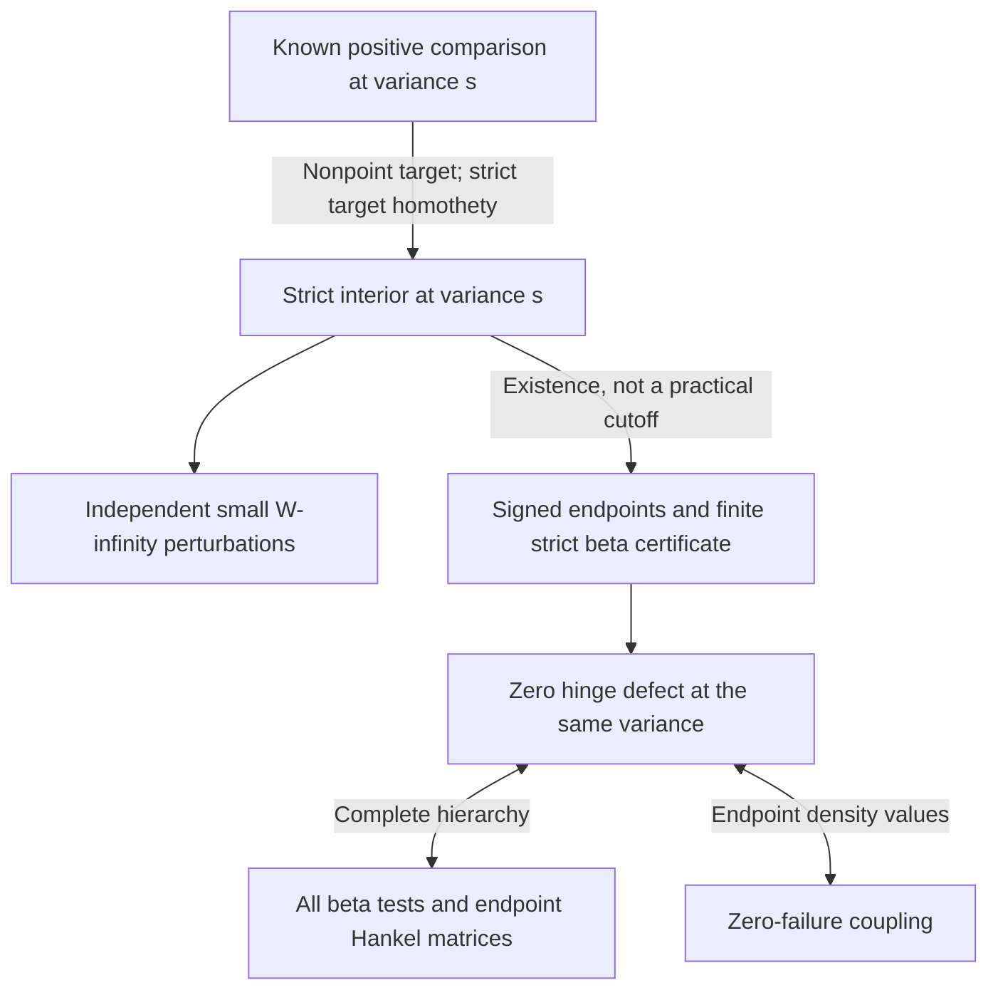

# Functional-inequality and stability handoff for Team B

Consolidation, 26 September 2026. This records implications of the existing
sources; it adds no comparison theorem, extension, numerical radius, or
independent proof review. Each source retains its recorded review status;
the bounded-law, ordered-weight and matrix-path proofs await independent
review. The unrestricted three-dimensional problem remains
open. The source revisions and graph references are pinned in
[HANDOFF_SOURCES.json](HANDOFF_SOURCES.json).

The lane's completed mechanism is **signed threshold endpoints plus finite
strict moment control at one variance**. Its stability theorem explains
where these certificates exist and persist. Its ordered-weight theorem is
a separate positive class with its own geometric endpoint. These facts
complement the [global dependency map](../gaussian_majorisation_global_criterion/DEPENDENCIES.md)
and [geometric scope map](../gaussian_axial_cone_rotations/SCOPE.md).

## 1. The full question, an individual comparison, and their quantifiers

For bounded probability laws \(\mu,\nu\), let
\(f_s=\mu*\gamma_s\), \(g_s=\nu*\gamma_s\), with covariance \(sI_3\), and
\(H_f(a)=\int(f-a)_+\). Define the ambient comparison set

\[
 \mathcal M_s=\{(\mu,\nu):H_{g_s}(a)\ge H_{f_s}(a)
                              \text{ for every }a>0\}.
\]

No map between the laws is part of this definition. The human-named question
asks whether **every** bounded \(\mu\) and **every** 1-Lipschitz T satisfy
\((\mu,T_\#\mu)\in\mathcal M_s\) for **every** \(s>0\).
The primary [Aishwarya--Li paper](https://arxiv.org/html/2609.07041v2)
settles all convex energies in dimensions at most two and a restricted
pressure class in dimension three; the latter is not the full question.

| Statement | Exact reach | What it does not supply |
|---|---|---|
| [Global criterion](../gaussian_majorisation_global_criterion/PROOF.md), Theorems 1--2 | At a fixed law pair and variance: full hinge order iff zero hinge defect iff every beta test is nonnegative iff the complete endpoint Hankel hierarchy is positive semidefinite iff a five-dimensional endpoint density-value coupling has zero failures. | The equivalences construct no new positive class by themselves. A density-value coupling is not a motion or a position martingale. |
| [Fixed-atom reduction](../gaussian_majorisation_global_criterion/ANCHOR_REDUCTION.md), Section 1 | The full bounded-law question is equivalent to proving it at variance one for all \((1-\epsilon)\delta_0+\epsilon\rho\), one prescribed \(0<\epsilon<1\), every bounded \(\rho\), and every contraction fixing zero. | The support bound may vary with \(\rho\); an ordered-ray remainder is not an arbitrary remainder. No comparison for this full test class has been established. |
| [Common-set transfer](../gaussian_prior_localization/PROOF.md), Sections 1--3 | For fixed compact K, continuous T and variance s, comparison for every law on K is equivalent to: for every finite positive-volume set A, there is one set B of the same volume with \(\int_B\gamma_s(z-Tx)\,dz\ge\int_A\gamma_s(z-x)\,dz\) simultaneously for every \(x\in K\). | The set B depends on A, K, T and s. The sign for arbitrary contractions is still open. The fixed-atom version retains compensation from that atom; it does not require each rare-centre inequality to be nonnegative separately. |
| [Strict rational reduction](../gaussian_majorisation_rank_abel/PROOF.md), Section 4 | Any violation has a finite witness at variance one with rational coordinates, positive rational weights, rational threshold and strict pairwise contraction. | This is a reduction of a hypothetical violation, not a found counterexample or a finite search bound. |

The fixed-atom source also describes conditional violations approaching a
common Gaussian in several weaker topologies. At fixed variance their rare
support is distant in \(W_\infty\); after normalizing support size the
variance tends to zero. This does not contradict the local stability below.
The common-set source's uniquely diffuse optimizer is compatible with finite
strict witnesses. It also separates two meanings of finite: the certificate
below uses finitely many moments of a given law, and does not assert a
finitely supported optimizing law for the all-law minimax problem.

## 2. The central inclusion map

Use the product \(W_\infty\) topology on the two bounded laws at a fixed s.
Let \(\mathcal F_s\) consist of pairs meeting the hypotheses of
[BOUNDED_LAWS.md, Theorem C](BOUNDED_LAWS.md) for some finite degree and valid
endpoint certificates. Let \(\mathcal B_{\le N,s}\) consist of pairs passing
all bare beta nonnegativity tests through degree N. The published results
give the following bookkeeping implications:

\[
 \boxed{\quad
 \mathcal M_s^\circ\ \subseteq\ \mathcal F_s\ \subseteq\
 \mathcal M_s\ \subseteq\ \mathcal B_{\le N,s},
 \qquad
 \mathcal M_s=\bigcap_{N\ge0}\mathcal B_{\le N,s},\quad
 \overline{\mathcal M_s^\circ}=\mathcal M_s.
 \quad}                                                       \tag{H1}
\]

The first inclusion is **existence of a finite certificate on the interior**;
it is not an effective algorithm for an unspecified measure. The second is
the certificate's sufficient implication. No equality between
\(\mathcal F_s\) and either neighboring set, no strictness of these
inclusions, and no finite universal cutoff is asserted. In particular a
finite passing beta or Hankel list does not supply the endpoint and error
premises defining \(\mathcal F_s\).
The fixed-density moment identities used here require probability
normalization and continuous normalized hinges, not a map between the laws;
the bounded-law source already uses them for these ambient pairs.

For a known member of \(\mathcal M_s\) with nonpoint target, every strict
target homothety \(\nu\mapsto(c\,\mathrm{id})_\#\nu\), \(0<c<1\),
puts the pair in \(\mathcal M_s^\circ\). This is a transfer from an already
known comparison. It is not a proof that an unknown contraction belongs to
\(\mathcal M_s\), or a continuation argument through its boundary.

The arrows distinguish a **proof dependency** from inclusion of geometric
classes. They do not say that a motion class, a weight cone, and a topology
neighborhood are the same set of contractions.

## 3. What the bounded-law stability theorem actually needs

For a compact support K, use normalized sphere measure \(\sigma\) and
\(w(K)=\int_{S^2}\sup_{z\in K}\theta\cdot z\,d\sigma(\theta)\),
half the usual mean width. By [Theorems A--B](BOUNDED_LAWS.md), a pair lies
in \(\mathcal M_s^\circ\) exactly when

\[
\begin{split}
 w(\operatorname{supp}\mu)&>w(\operatorname{supp}\nu),\\
 \|f_s\|_\infty&<\|g_s\|_\infty,\\
 H_{g_s}(a)&>H_{f_s}(a)\quad(0<a<\|g_s\|_\infty).
\end{split}                                                    \tag{H2}
\]

| Obligation | Role in the proof | Uniformity boundary |
|---|---|---|
| Strict mean-support gap | A finite support net and its positive assigned cell masses give a signed comparison at every sufficiently low threshold. | The net is fixed before taking the tail limit. Its mass floor depends on the law and net scale, including for nonatomic laws. |
| Strict middle hinges | Compactness of a positive threshold interval gives a positive minimum, retained by Gaussian L1 continuity. | This is an input to the stability theorem; it is an output, not an input, of the finite certificate in Section 4. |
| Strict peak gap | A common cutoff lies above the perturbed source peak, where its hinge vanishes. | A genuine supremum bound is needed; sampling the density is insufficient. |
| Bounded support and positive variance | Gaussian continuity and finite support nets handle independent atomic, singular and nonatomic perturbations. | The theorem has no single radius for every bounded law or for all variances down to zero. |

For a fixed known all-variance pair with nonpoint target and fixed
\(0<c<1\), the compactness conclusion has the order of quantifiers

\[
 \forall I\Subset(0,\infty)\ \exists\varepsilon_I>0\
 \forall(\mu',\nu')\text{ in that }W_\infty\text{ neighborhood}\
 \forall s\in I\ \forall a>0:\quad H_{g'_s}(a)\ge H_{f'_s}(a). \tag{H3}
\]

The radius depends on the seed laws, damping and interval. Independent
perturbations need not themselves be related by a contraction; that
requirement must be verified separately when producing a member of the
named problem. Changing isolated atom weights need not be a small
\(W_\infty\) perturbation; the original finite-base theorem has a separate
weight-perturbation statement.

Point targets are handled in Theorem B: a nonpoint source compared with
a point target is already interior; two point masses form a boundary pair
approximable by splitting the source. The nonpoint hypothesis in the strict
target-homothety step must not be omitted.

## 4. The finite positive certificate: input and output contract

At one fixed \(s>0\), set

\[
 C=(2\pi s)^{-3/2},\quad H(u)=H_{g_s}(Cu)-H_{f_s}(Cu),\quad
 a_j=\frac{C\int[(g_s/C)^{j+2}-(f_s/C)^{j+2}]}{(j+1)(j+2)},
\]
\[
 b_{N,k}=(N+1){N\choose k}\sum_{\ell=0}^{N-k}
                  (-1)^\ell{N-k\choose\ell}a_{k+\ell}.
                                                                  \tag{H4}
\]

The [global criterion](../gaussian_majorisation_global_criterion/PROOF.md)
identifies \(a_j=\int_0^1u^jH(u)\,du\) and \(b_{N,k}=\mathbb E H(V)\)
for \(V\sim\operatorname{Beta}(k+1,N-k+1)\).
If the supports fit, after separate translations, in radius-R balls, a valid
one-half Holder constant is

\[
 L=2\sqrt{2/\pi}\,[r^3/3+\sqrt\pi r^2+4r+2\sqrt\pi],
 \qquad r=R/\sqrt{s}.
                                                                  \tag{H5}
\]

To apply the finite theorem, supply each of the following:

1. **A signed low-threshold proof:** \(H(u)\ge0\) on \([0,\tau]\).
   The fixed-net geometric argument is one available source; an unsigned
   small error is not this premise.
2. **A certified source peak bound:** \(\|f_s\|_\infty/C\le b\), with
   \(0<\tau<b<1\).
3. **A valid modulus:** \(|H(u)-H(v)|\le L|u-v|^{1/2}\), for example (H5).
4. **Finite strict lower bounds:** for some \(N\ge0\), every selected
   \(b_{N,k}\) is greater than
   \[
   E_N=L\left[\frac1{4(N+3)}+\frac1{(N+2)^2}\right]^{1/4},
   \quad
   J_N=\left\{0\le k\le N:
    \operatorname{dist}\!\left(\frac{k+1}{N+2},[\tau,b]\right)
                                  \le\frac1{N+2}\right\}.
                                                                  \tag{H6}
   \]

Then every hinge compares at **that same variance**, hence all convex-energy
comparisons for which the energies are defined and the complete beta/Hankel
hierarchy hold. In fact the finite
endpoint Hankel matrices for distinct nonnegative integer exponents are
positive definite, because the proof gives \(H>0\) on \([\tau,b]\).
Only powers through \(N+2\) enter the test.

The unsampled thresholds are controlled explicitly: choose a nearby beta
mean for each \(u\in[\tau,b]\); its variance is at most \(1/[4(N+3)]\).
The modulus gives \(|b_{N,k}-H(u)|\le E_N\). The first endpoint proof
handles \([0,\tau]\), and the source peak bound handles \([b,1]\).
This is the existing proof of Theorem C, not an additional result here.
Its one-pair conclusion does not supply the simultaneous all-law sign
required by the common-set transfer criterion in Section 1.

For an interior pair one can choose b between the normalized peaks and
\(\tau\) in the signed low range. Then \(h_*:=\min_{[\tau,b]}H>0\), and
\(2E_N<h_*\) eventually proves all the selected inequalities. This explains
the first inclusion in (H1); it does not give a practical degree for arbitrary
data. To **certify a previously unknown pair**, the four displayed inputs
suffice without assuming its middle hinges are positive. For rational atomic
data the moments are finite exponential sums, but certified enclosures must
control the alternating sums in (H4). For an unspecified bounded law, no
effective access to these numbers or to the endpoint proofs is promised.

## 5. Where the broad geometric classes and examples belong

The following table is an inclusion/dependency handoff, not a ranking or a
claim that all sufficient geometric criteria are nested.

| Layer | Durable source and retained hypotheses | Consequence and boundary |
|---|---|---|
| Broad motion classes | [Paired rank at most five](../gaussian_majorisation_rank_abel/PROOF.md), [scalar-defect budget](../gaussian_majorisation_scalar_defect/PROOF.md), [simplicial dual cones](../gaussian_simplicial_cone_reflections/PROOF.md) | All bounded input laws and variances on each certified domain; their finite-center motion transfers give arbitrary individual-radius union and intersection inequalities. A sufficient rank or budget condition is not necessary for positivity. |
| Broad axial/matrix motion class | [Transverse matrix paths](../gaussian_axial_cone_rotations/MATRIX_PATHS.md), containing the earlier [axial product-perimeter criterion](../gaussian_axial_cone_rotations/PROOF.md) | All bounded laws, weights and variances on the stated cone domain. A path on the transverse operator-norm unit sphere with support cost at most two supplies an R5 motion. Arbitrary individual-radius unions and intersections follow when each finite motion is piecewise analytic. The explicit circular path gives this for opening product \(pq\le1/(1+\cos1)\). Its optimality is restricted to the specified block-diagonal relative Gram paths. |
| Damped motion and uniform geometric robustness | [Damped path criterion](../gaussian_damped_cone_reflections/PROOF.md), [uniform axial robustness](../gaussian_axial_cone_rotations/ROBUSTNESS.md) | All bounded laws and variances on the stated domains. Their ball conclusions retain the stated piecewise-analytic control/motion hypotheses. Robustness allows controlled nonlinear endpoints with a reserved target scaling; its deformation lemma also applies to the R5 matrix lift. These are domain-wide conclusions, with different geometric hypotheses from (H3). |
| Broad functional class with a geometric endpoint | [Ordered-weight rays](../gaussian_majorisation_square_cone_orbits/ORDERED_WEIGHTS.md) | Every variance and bounded measure-ordered radial law, with unbounded ordered weight ratios. Finite complete ray quartets give union comparison for independently ordered radii at each shell, even under the specified invariant ambient measures. Arbitrary unordered radii and intersections are not proved. |
| Broad functional classes without a new ball-radius conclusion from the analytic step | [Common-target mixtures](../gaussian_majorisation_common_target/PROOF.md), [original fixed-base orbit cones](../gaussian_majorisation_square_cone_orbits/PROOF.md) | Every variance, with their radial/core and weight hypotheses. Common-target convexity needs one identical target law. The original orbit cones' radius limits have the [known rematching proof](../gaussian_majorisation_global_criterion/GEOMETRIC_LIMIT.md). |
| Stability mechanism | [Bounded-law interior and finite certificates](BOUNDED_LAWS.md) | Applies to arbitrary bounded law pairs satisfying its strict hypotheses, including known members of the preceding classes after damping. Its output is (H3) or one fixed-variance certificate; it does not supply a new small-variance geometric limit. |
| Constrained all-variance neighborhood | [Paired-layer completion](../gaussian_paired_layers_majorisation/ALL_VARIANCES.md) | Uses the original spatial stability theorem on \([10^{-10},45056]\), plus separate uniform small- and large-variance estimates. The central transverse symmetry, paired planes, contraction inequalities and radius-\(1/25000\) weight ball remain necessary hypotheses of that source. Its spatial radius is existential. |
| Restricted fixtures | The nine-site square-cone law, its distinct-radius ball fixture, and the axial 25-point example | Witnesses for the source theorems and distinctions between methods; they are not the full breadth of those theorems. An obstruction to a center motion is compatible with positive Gaussian majorisation. |
| Finite-order and unsigned evidence | [Sparse Hankel estimates](../gaussian_sparse_hankel_hierarchy/PROOF.md), [replica curvature](../gaussian_replica_curvature_sparse_energies/PROOF.md), [audited entropy bridge](../gaussian_majorisation_bridge_barrier/AUDIT.md) | Preserve the specific energy, finite-order, variance and unsigned-error conclusions. None replaces the four finite-certificate inputs. A later finite moment audit is not automatically an all-order certificate. |

Several relations are exact and useful for avoiding duplicated work:

- The axial product-perimeter criterion is contained in the matrix-path
  criterion: an orthogonal transverse path recovers its cost exactly. For
  circular cones the old \(pq\le2/\pi\) range is contained in
  \(pq\le1/(1+\cos1)\), with the angle measured in radians. This is an
  inclusion of established sufficient criteria, not a classification of
  all R5 motions or all contractions.
- The original radius-\(1/552\) nine-site weight ball contains the prior
  radius-\(1/4000\) obstruction family and the stated smaller high-variance
  weight family. Its all-variance conclusion already removes those variance
  cutoffs. This containment concerns the same sites and central weights.
- The paired-layer completion depends on the **original** spatial-cloud
  theorem, not the later bounded-law interior or finite-certificate extension.
  The latter does not remove its paired-layer restrictions.
- The ordered-weight cone and the original fixed-base cone are complementary
  certificates; no containment between their entire weight classes is claimed.
  Their distinct certificates must not be merged into an arbitrary-weight claim.
- The ordered-radius fixture has no R5 motion for its prescribed matching
  and escapes its exposed-ball radius rematching alternatives. This separates
  it from those motion/rematching certificates; it does not contradict them
  or classify every conceivable geometric proof.
- The matrix-path class permits arbitrary laws and individual radii on its
  cone domains; the ordered-ray class instead imposes weight/radius order
  and includes the preceding no-R5-motion fixture. Neither theorem contains
  the other in its full domain and weight/radius scope. Both can supply seed
  law pairs for (H3); that stability transfer does not enlarge their stated
  all-variance ball-radius conclusions.

## 6. What would promote a result toward the shared headline

| Desired conclusion | Missing obligation, if it is not already a source hypothesis |
|---|---|
| Full R3 theorem | Zero defect for every bounded remainder and every contraction in the fixed-atom reduction, or an equivalent unrestricted zero-defect proof. |
| Rigorous counterexample | A negative hinge or finite negative beta/Hankel witness for a verified contraction, with rigorous numerical or exact sign control. A negative comparison-method test is not enough. |
| Positive comparison for one new pair at one variance | The four inputs in Section 4, or another complete all-threshold proof. Bare finite moment positivity is insufficient. |
| One neighborhood valid at every positive variance | Uniform control at both variance ends in addition to compact-band stability, as in the paired-layer source, or an appropriate domain-wide geometric theorem. |
| New prescribed-radius union comparison | An admissible exponential-weight path down to zero variance with the required threshold sign or defect scale from the [endpoint annex](../gaussian_majorisation_global_criterion/GEOMETRIC_LIMIT.md). The ordered-weight source meets this for its stated radii. |

The [tail-deficit route](../gaussian_tail_deficit_obstruction/PROOF.md)
remains closed. No new negative-bridge series or
extension is proposed by this consolidation. The previously saved pre/post
deformation sketch is deferred rather than promoted to a proved result.

## 7. Review and preservation boundary

The critical review targets for this lane are the fixed-net tail uniformity,
strict posterior-covariance homothety argument, exact-interior necessity,
and beta localization with its signed endpoints. The unchanged `verify.py`
in this directory checks the original finite square-cone strictness inputs;
it does **not** prove the bounded-law topology or Theorem C.
The two ordered-weight algorithms verify a different finite correlation
lemma; they do not independently review these analytic arguments.

The [entropy audit](../gaussian_majorisation_bridge_barrier/AUDIT.md) accepted
that covariance-free result in its own scope. Its review status does not
transfer to stability, the ordered-weight result or this handoff. Likewise,
source publication and graph commitment record provenance, not acceptance.

For this consolidation, the original proof and certificate bytes are
preserved. Validation consists of checking the displayed implications
against their source hypotheses, checking pinned file hashes and revisions,
and verifying public reader links. No fresh numerical experiment is reported,
and no earlier large proof computation is rerun merely for a documentation
change. The exact index is [HANDOFF_SOURCES.json](HANDOFF_SOURCES.json).
